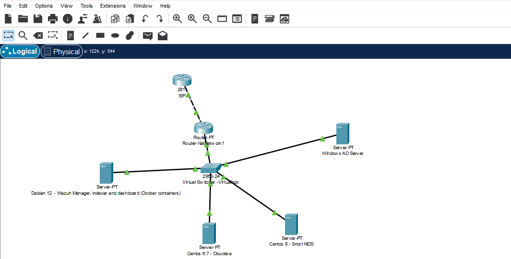

# Wazuh SIEM deployment in a Virutalized envirment 

Deployed a full Wazuh SIEM stack in a local VirtualBox environment to get hands-on with security monitoring. The goal was to understand how a real SOC setup works log ingestion, alert correlation, vulnerability detection, and active response without touching anything production.



## The lab

Four VMs on a VirtualBox NatNetwork with DHCP:

| VM | OS | Role |
|----|-----|------|
| wazuh-server | Debian 12 | Runs the 3 Wazuh containers (manager + indexer + dashboard) |
| ad-server | Windows Server 2022 | Active Directory generates auth events |
| cloudera-vm | CentOS 6.7 | Cloudera cluster generates a lot of noise, good for testing |
| snort-vm | CentOS 8 | Snort NIDS forwarding IDS alerts into Wazuh |

Wazuh itself runs as Docker containers on the Debian VM. All other VMs run the Wazuh agent and report back to the manager.

## How the stack fits together

```
Agents (Windows / CentOS / Snort)
        │  port 1514/tcp (encrypted)
        ▼
  Wazuh Manager   ←── ossec.conf
        │
        │  Filebeat (ships alerts in unified2 → JSON)
        ▼
  Wazuh Indexer (OpenSearch)   ←── filebeat.yml
        │
        ▼
  Wazuh Dashboard (port 443)
```

The manager does all the analysis decoding logs, matching rules, triggering active responses. The indexer is just storage. The dashboard is the UI on top.

## Config files

`config/ossec.conf` the main manager config. The parts I actually touched:

- `<alerts>` set `log_alert_level` to 3 so only meaningful events generate alerts (default is too noisy)
- `<remote>` agents connect on port 1514 over TCP, queue size bumped to 131072 for the Cloudera VM which generates a ton of events
- `<syscheck>` file integrity monitoring on `/etc`, `/bin`, `/sbin`, `/boot` alerts when anything in those paths changes
- `<vulnerability-detection>` enabled, updates CVE feed every 60 minutes
- `<rootcheck>` runs every 12 hours checking for rootkits, suspicious files, open ports
- `<active-response>` left commented out for now, commands are defined (`firewall-drop`, `host-deny`, `disable-account`) but not wired to rules yet

`config/filebeat.yml` ships alerts from the manager to the indexer. Only alerts are forwarded (`archives: false`) to keep the index size reasonable.

> ⚠️ `filebeat.yml` contains the indexer password in plaintext it's in `.gitignore`, don't commit the real version.

## Setup

### Deploy Wazuh (Docker)

```bash
# on the Debian VM
git clone https://github.com/wazuh/wazuh-docker.git -b v4.9.2
cd wazuh-docker/single-node
docker-compose -f generate-indexer-certs.yml run --rm generator
docker-compose up -d
```

Wait a couple minutes for everything to start, then hit `https://<debian-vm-ip>` default creds are `admin / SecretPassword` (change these immediately).

Screenshots: `docs/screenshots/01-docker-install.png`, `02-docker-install-2.png`, `03-manager-installed.png`, `04-manager-indexer-startup.png`

### Install the config

```bash
# copy ossec.conf into the running manager container
docker cp config/ossec.conf $(docker ps -qf name=wazuh-manager):/var/ossec/etc/ossec.conf
docker exec $(docker ps -qf name=wazuh-manager) /var/ossec/bin/wazuh-control restart
```

### Deploy agents

On Linux (CentOS/Debian):

```bash
# get the install command from the dashboard: Agents > Deploy new agent
# it generates a one-liner with your manager IP baked in, looks like:
curl -s https://packages.wazuh.com/key/GPG-KEY-WAZUH | gpg --no-default-keyring --keyring gnupg-ring:/usr/share/keyrings/wazuh.gpg --import
# ... (grab the full command from the dashboard, it varies by OS)

systemctl enable wazuh-agent
systemctl start wazuh-agent
```

On Windows download the MSI from the dashboard, run it, enter the manager IP when prompted. Screenshot: `docs/screenshots/08-agent-running-windows.png`

### Validate the manager config

```bash
docker exec $(docker ps -qf name=wazuh-manager) /var/ossec/bin/wazuh-logtest
```

Paste a raw log line and it shows you which decoder matched, which rule fired, and what alert level it would generate. Useful for testing before deploying custom rules. Screenshot: `docs/screenshots/10-logtest.png`

## What I got working

- All 4 VMs reporting to the manager and showing up in the dashboard
- FIM alerts triggering when files change under `/etc` on the Linux VMs  
- CVE vulnerability scan running against all agents
- Active Directory authentication events (logon/logoff, failed logins) coming through from the Windows VM
- Snort IDS alerts showing up in Wazuh alongside the endpoint events
- SCA (Security Configuration Assessment) running CIS benchmarks against the Linux agents

## What I didn't finish

Active response the commands are defined in `ossec.conf` (`firewall-drop`, `disable-account`) but I didn't wire them to specific rules. Didn't want to accidentally block myself out of a VM. That's next.

Email alerts are configured with a Postfix relay through Gmail but I didn't commit those credentials obviously.

## Screenshots

| File | What it shows |
|------|--------------|
| `00-network-topology.png` | VirtualBox NatNetwork layout |
| `01-02` | Wazuh Docker containers spinning up |
| `03-04` | Manager and indexer confirmed running |
| `05` | Agent enrollment config in the manager |
| `06-07` | Agent install + running on Cloudera VM |
| `08` | Agent service running on Windows Server |
| `09` | Filebeat config (default before edits) |
| `10` | Logtest decoder/rule matching demo |
| `11-15` | Dashboard alerts, agents, vulnerabilities |
